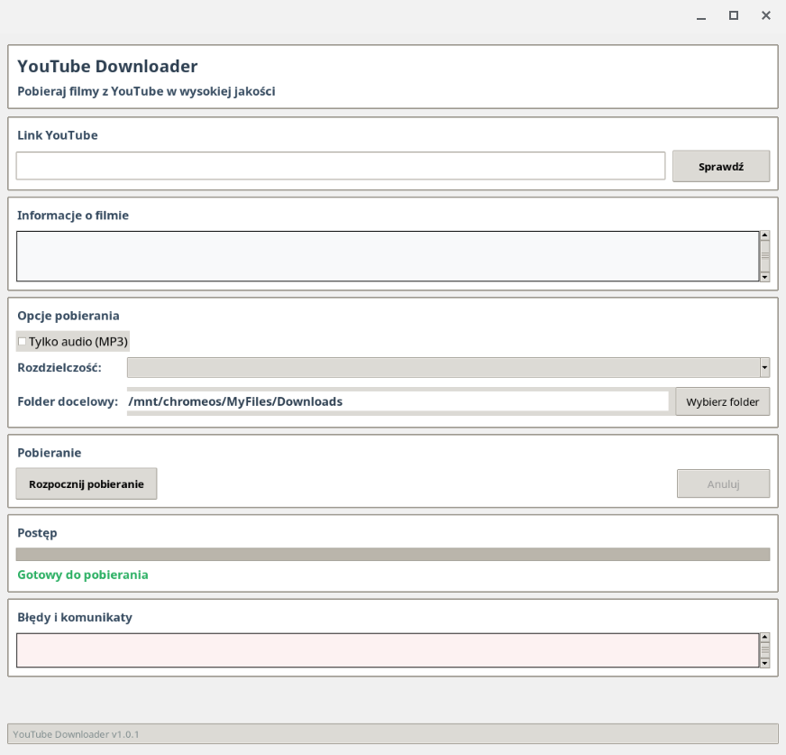

# YouTube Downloader

Prosta aplikacja w Python do pobierania filmów z YouTube z interfejsem graficznym.



## ✨ Funkcje aplikacji

### 🎯 **Główne możliwości:**
- 📥 **Pobieranie filmów** - z YouTube i innych platform
- 🎨 **Intuicyjny interfejs** - łatwy w użyciu GUI
- 📊 **Wybór jakości** - sortowanie formatów od najwyższej do najniższej
- 📁 **Zapamiętywanie ścieżki** - aplikacja pamięta ostatnio wybrany katalog
- ⚡ **Szybka praca** - zoptymalizowana wydajność

### 📦 **Gotowy pakiet .deb:**
- 🎯 **Łatwa instalacja** - `sudo dpkg -i youtube-downloader_1.0.3_all.deb`
- 🔧 **Automatyczna deinstalacja** - `sudo dpkg -r youtube-downloader`
- 🛡️ **Bezpieczne skrypty** - kompatybilne z różnymi dystrybucjami Linux

## ⚠️ UWAGA PRAWNA

**Ta aplikacja jest narzędziem technicznym. Użytkownik odpowiada za legalność pobierania treści.**

### ✅ DOZWOLONE UŻYCIE:
- **Własne treści YouTube** - autor może pobierać swoje filmy
- **Treści na licencji** - CC, Creative Commons, public domain
- **Backup własnych materiałów** - kopie zapasowe własnych treści
- **Użycie edukacyjne** - w ramach dozwolonego użytku (fair use)

### ❌ NIEDOZWOLONE UŻYCIE:
- **Pobieranie cudzych treści** bez zgody autora
- **Dystrybucja pobranych treści** komercyjnie
- **Obejście zabezpieczeń** DRM
- **Naruszenie praw autorskich**

### 📋 ODPOWIEDZIALNOŚĆ:
- **Aplikacja sama w sobie nie jest nielegalna** - to neutralne narzędzie
- **Odpowiedzialność leży po stronie użytkownika**
- **Respektuj prawa autorskie i regulamin YouTube**
- **Pobieraj tylko treści własne lub na licencji**
- **Użycie aplikacji musi być zgodne z [Warunkami serwisu YouTube](https://www.youtube.com/t/terms)**
- **Przestrzegaj [Zasad społeczności YouTube](https://www.youtube.com/howyoutubeworks/policies/community-guidelines/)**
- **Respektuj [Politykę praw autorskich YouTube](https://www.youtube.com/yt/copyright/)**
- **Zgodność z [YouTube API Terms of Service](https://developers.google.com/youtube/terms/api-services-terms-of-service)**
- **Przestrzegaj [YouTube Data API v3 Terms of Service](https://developers.google.com/youtube/terms/api-services-terms-of-service)**


## 🛠️ Instalacja

### Wymagania systemowe:
- Linux (Ubuntu, Debian, Chrome OS, inne dystrybucje)
- Python 3.8+ (automatycznie instalowany przez pakiet)
- Dostęp do internetu (do pobierania filmów)

### Instalacja z pakietu .deb (zalecana)
```bash
# Pobierz pakiet .deb z GitHub Releases:
# https://github.com/george7979/youtube-downloader/releases/tag/v1.0.3

# Zainstaluj pakiet
sudo dpkg -i youtube-downloader_1.0.3_all.deb

# Jeśli są problemy z pakietem .deb (nie z aplikacją)
sudo apt-get install -f
```

**Uwaga:** Pakiet automatycznie sprawdza i instaluje wymagane zależności systemowe. Wszystkie zależności Python są instalowane w izolowanym środowisku wirtualnym aplikacji, więc nie wpływa na inne aplikacje w systemie.

### Uruchomienie po instalacji
```bash
# Z terminala
youtube-downloader

# Lub znajdź w menu aplikacji
```

### Deinstalacja
```bash
# Usuń pakiet .deb (automatycznie usuwa środowisko wirtualne)
sudo dpkg -r youtube-downloader

# Lub całkowita deinstalacja z plikami konfiguracyjnymi
sudo dpkg -P youtube-downloader
```

**Uwaga:** Deinstalacja automatycznie usuwa izolowane środowisko wirtualne aplikacji, więc nie wpływa na inne aplikacje w systemie.

## 🔧 Rozwiązywanie problemów

### Jeśli aplikacja nie uruchamia się:
```bash
# Przeinstaluj aplikację
sudo apt reinstall youtube-downloader
```

### Jeśli instalacja się nie powiedzie:
```bash
# Napraw zależności
sudo apt-get install -f

# Spróbuj ponownie
sudo dpkg -i youtube-downloader_1.0.3_all.deb
```

## 🚀 Uruchomienie

Po instalacji z pakietu .deb:
```bash
youtube-downloader
```

Prosta aplikacja uruchomi się z interfejsem graficznym.

## 🎮 Jak używać

### 1. Uruchom aplikację
```bash
youtube-downloader
```

### 2. Wklej link YouTube
Wprowadź link do filmu YouTube w pole tekstowe.

### 3. Sprawdź film
Kliknij przycisk "Sprawdź" aby pobrać informacje o filmie.

### 4. Wybierz opcje
- **Tylko audio**: Zaznacz checkbox dla pobierania tylko MP3
- **Rozdzielczość**: Wybierz z posortowanej listy (od najwyższej do najniższej jakości)
- **Folder**: Kliknij "Wybierz folder" aby wybrać katalog docelowy (aplikacja zapamięta ostatnią ścieżkę)

### 5. Pobierz
Kliknij "Pobierz" aby rozpocząć pobieranie.
