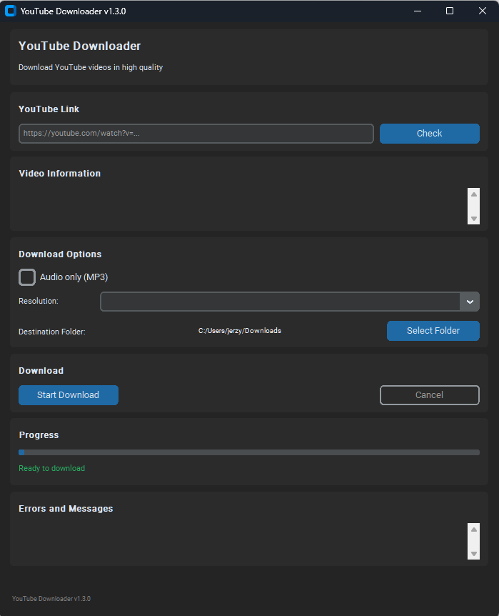

# YouTube Downloader

Simple Python application for downloading videos from YouTube with a graphical interface.



## ✨ Features

- 📥 **Download videos** from YouTube and other platforms
- 🎨 **Intuitive graphical** interface
- 📊 **Quality selection** for video and audio
- 📁 **Remember download path** between sessions
- ⚡ **Fast and stable** operation

## ⚠️ Legal Notice

**This application is a technical tool. The user is responsible for the legality of downloading content.**

### ✅ Allowed use:
- Your own YouTube content (authors can download their own videos)
- Content under Creative Commons licenses, public domain
- Backup of your own materials
- Educational use within fair use

### ❌ Prohibited use:
- Downloading others' content without author's consent
- Commercial distribution of downloaded content
- Copyright infringement

**Respect copyright and [YouTube Terms of Service](https://www.youtube.com/t/terms).**

## 🛠️ Installation

### System requirements:
- Linux (Ubuntu, Debian, other distributions)
- Python 3.8+ (installed automatically)
- Internet access

### Installation from .deb package (recommended)

1. **Download the latest package:**
   ```bash
   # Go to: https://github.com/george7979/youtube-downloader/releases
   # Download youtube-downloader_X.X.X_all.deb
   ```

2. **Install the package:**
   ```bash
   sudo dpkg -i youtube-downloader_*.deb
   sudo apt-get install -f  # fix dependencies if needed
   ```

**Note:** The package automatically installs all required dependencies in an isolated environment, without affecting other applications.

## 🚀 Running

```bash
youtube-downloader
```

Or find the application in the system menu.

## 🎮 How to use

### 1. Launch the application
```bash
youtube-downloader
```

### 2. Paste YouTube link
Enter the video URL in the text field.

### 3. Check video
Click "Check" to retrieve video information.

### 4. Select options
- **Audio only**: Check for MP3 download
- **Quality**: Choose resolution from the list
- **Folder**: Click "Select Folder" to choose directory

### 5. Download
Click "Download" to start downloading.

## 🔧 Troubleshooting

### Application won't start:
```bash
sudo apt reinstall youtube-downloader
```

### Installation errors:
```bash
sudo apt-get install -f
sudo dpkg -i youtube-downloader_*.deb
```

### Download errors:
- Check internet connection
- Make sure the link is correct
- Some videos may be regionally blocked

## 🗑️ Uninstallation

```bash
# Standard uninstallation
sudo dpkg -r youtube-downloader

# Complete removal with configuration
sudo dpkg -P youtube-downloader
```

## 🐛 Reporting issues

Found a bug? Have a feature suggestion?

**Report in GitHub Issues:** https://github.com/george7979/youtube-downloader/issues

