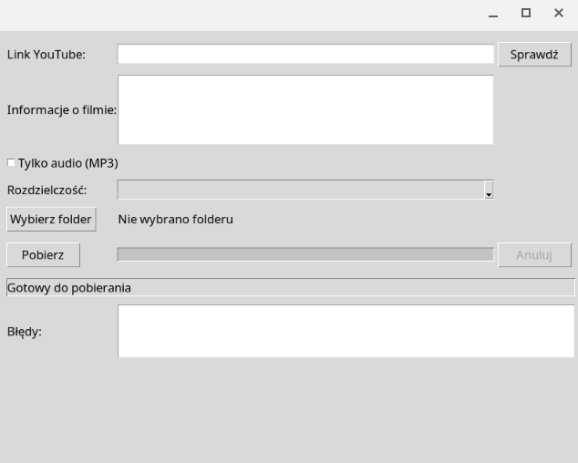

# YouTube Downloader

Prosta aplikacja w Python do pobierania filmów z YouTube z interfejsem graficznym.



## ⚠️ UWAGA PRAWNA

**Ta aplikacja jest narzędziem technicznym. Użytkownik odpowiada za legalność pobierania treści.**

### ✅ DOZWOLONE UŻYCIE:
- **Własne treści YouTube** - autor może pobierać swoje filmy
- **Treści na licencji** - CC, Creative Commons, public domain
- **Backup własnych materiałów** - kopie zapasowe własnych treści
- **Użycie edukacyjne** - w ramach dozwolonego użytku (fair use)

### ❌ NIEDOZWOLONE UŻYCIE:
- **Pobieranie cudzych treści** bez zgody autora
- **Dystrybucja pobranych treści** komercyjnie
- **Obejście zabezpieczeń** DRM
- **Naruszenie praw autorskich**

### 📋 ODPOWIEDZIALNOŚĆ:
- **Aplikacja sama w sobie nie jest nielegalna** - to neutralne narzędzie
- **Odpowiedzialność leży po stronie użytkownika**
- **Respektuj prawa autorskie i regulamin YouTube**
- **Pobieraj tylko treści własne lub na licencji**
- **Użycie aplikacji musi być zgodne z [Warunkami serwisu YouTube](https://www.youtube.com/t/terms)**
- **Przestrzegaj [Zasad społeczności YouTube](https://www.youtube.com/howyoutubeworks/policies/community-guidelines/)**
- **Respektuj [Politykę praw autorskich YouTube](https://www.youtube.com/yt/copyright/)**
- **Zgodność z [YouTube API Terms of Service](https://developers.google.com/youtube/terms/api-services-terms-of-service)**
- **Przestrzegaj [YouTube Data API v3 Terms of Service](https://developers.google.com/youtube/v3/terms)**

## 🎯 Funkcje

### ✅ Podstawowe funkcje:
- **Pobieranie filmów** z YouTube z wklejanego linku
- **Pobieranie z dźwiękiem** w formacie MP4
- **Wybór rozdzielczości** przed pobieraniem
- **Wybór katalogu docelowego** dla pobieranych plików
- **Walidacja linku YouTube** przed pobieraniem
- **Progress bar** pokazujący postęp pobierania
- **Obsługa błędów** (film nie istnieje, brak połączenia)
- **Informacje o filmie** (tytuł, czas trwania, dostępne formaty)
- **Przycisk "Anuluj"** podczas pobierania
- **Możliwość pobierania tylko audio** (MP3)
- **Automatyczne sanityzowanie nazw plików**


## 🛠️ Instalacja

### Wymagania systemowe:
- Linux (Ubuntu, Debian, Chrome OS)
- Python 3.8+ (wbudowany w większość systemów Linux)

### Instalacja z pakietu .deb (zalecana)
```bash
# Pobierz pakiet .deb z GitHub Releases:
# https://github.com/george7979/youtube-downloader/releases/tag/v1.0.0

# Zainstaluj pakiet
sudo dpkg -i youtube-downloader_1.0.0_all.deb

# Jeśli są problemy z pakietem .deb (nie z aplikacją)
sudo apt-get install -f
```

**Uwaga:** Prosta aplikacja używa izolowanego środowiska wirtualnego, więc nie wpływa na inne aplikacje w systemie. Wszystkie zależności Python są instalowane w środowisku wirtualnym aplikacji.

### Uruchomienie po instalacji
```bash
# Z terminala
youtube-downloader

# Lub znajdź w menu aplikacji
```

### Deinstalacja
```bash
# Usuń pakiet .deb (automatycznie usuwa środowisko wirtualne)
sudo dpkg -r youtube-downloader

# Lub ręcznie (jeśli pakiet nie został usunięty)
sudo rm -rf /usr/share/youtube-downloader
sudo rm -f /usr/bin/youtube-downloader
sudo rm -f /usr/share/applications/youtube-downloader.desktop
rm -rf ~/.youtube-downloader
```

**Uwaga:** Deinstalacja automatycznie usuwa izolowane środowisko wirtualne aplikacji, więc nie wpływa na inne aplikacje w systemie.

## 🚀 Uruchomienie

Po instalacji z pakietu .deb:
```bash
youtube-downloader
```

Prosta aplikacja uruchomi się z interfejsem graficznym.

## 🎮 Jak używać

### 1. Uruchom aplikację
```bash
youtube-downloader
```

### 2. Wklej link YouTube
Wprowadź link do filmu YouTube w pole tekstowe.

### 3. Sprawdź film
Kliknij przycisk "Sprawdź" aby pobrać informacje o filmie.

### 4. Wybierz opcje
- **Tylko audio**: Zaznacz checkbox dla pobierania tylko MP3
- **Rozdzielczość**: Wybierz z listy rozwijanej
- **Folder**: Kliknij "Wybierz folder" aby wybrać katalog docelowy

### 5. Pobierz
Kliknij "Pobierz" aby rozpocząć pobieranie.
